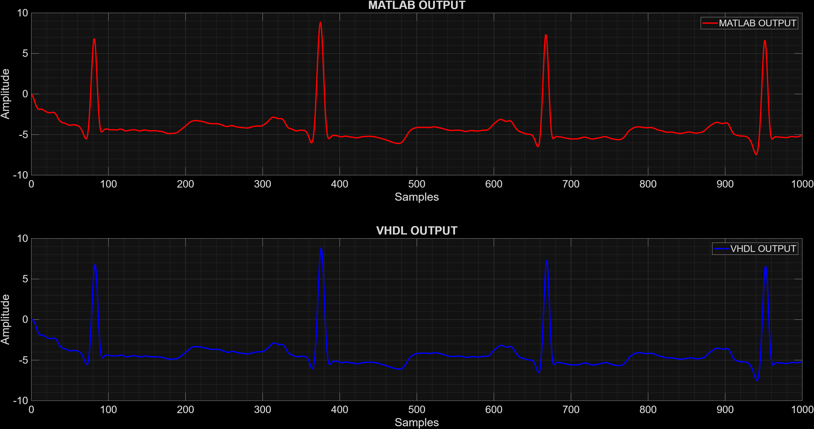
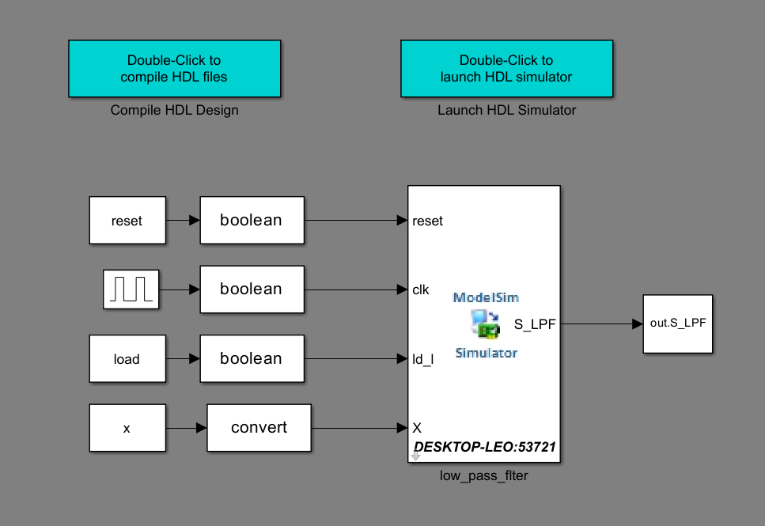

# VHDL Low-Pass Filter – Pan-Tompkins Algorithm

## Overview

This repository contains a **VHDL implementation of the low-pass filter stage of the Pan–Tompkins algorithm**, a classical and widely adopted method for **QRS complex detection** in electrocardiogram (ECG) signals.

The project integrates **MATLAB-based reference modeling**, **stimulus generation**, and **HDL co-simulation** to validate the functional equivalence between the software model and the hardware description. The low-pass filter is responsible for attenuating **high-frequency noise components**, such as muscle artifacts and power-line interference, while preserving the relevant morphological characteristics of the ECG waveform.

This implementation is intended for **hardware-oriented studies**, including **FPGA/ASIC design**, **VLSI optimization**, and **biomedical signal processing** applications.

---

## Mathematical Model

The discrete-time low-pass filter implemented in this project follows the original Pan–Tompkins formulation and is defined by the following difference equation:

\[
y[n] = 2y[n-1] - y[n-2] + x[n] - 2x[n-6] + x[n-12]
\]

Where:
- \( x[n] \) is the input ECG sample  
- \( y[n] \) is the filtered output sample  

This formulation is particularly suitable for **digital hardware implementation**, as it relies exclusively on additions, subtractions, and delay elements, avoiding multipliers.

---

## Hardware Design Characteristics

- **Description language**: VHDL  
- **Architecture**: Fully synchronous  
- **Arithmetic**: Fixed-point  
- **Filter type**: IIR (recursive) with feedforward and feedback paths  
- **Maximum delay**: 12 input samples  
- **Design focus**:
  - Low hardware complexity
  - Efficient register usage
  - Deterministic latency
  - Compatibility with FPGA and ASIC synthesis flows

---

## MATLAB Reference Model and Co-Simulation

The repository includes MATLAB scripts used for:

- Loading real ECG signals from the **MIT-BIH Arrhythmia Database**
- Generating test stimuli:
  - Impulse response
  - Step response
- Verifying signal normalization
- Computing the reference low-pass filter output
- Running **MATLAB/Simulink–VHDL co-simulation** using ModelSim/Questa

This flow enables direct comparison between:
- MATLAB floating-/fixed-point reference output
- VHDL hardware output

### MATLAB vs VHDL Output Comparison



### Co-Simulation Overview



---

## Project Structure

```text
.
├── .github/                 # GitHub configuration files
├── cosim_link/              # MATLAB/Simulink cosimulation files
├── data/
│   └── ECG_MIT_01.mat       # ECG signal from MIT-BIH database
├── figure/
│   ├── cosim.png            # Cosimulation illustration
│   └── Signal_Comparison.png# MATLAB vs VHDL output comparison
├── src/
│   ├── main_EN_US.m         # MATLAB main script (English)
│   └── main_PT_BR.m         # MATLAB main script (Portuguese)
├── vhdl/
│   └── Low_pass_filter.vhd  # VHDL low-pass filter implementation
├── startup.m                # MATLAB startup configuration
├── .gitignore
└── README.md                # Project documentation
```

## Run Project

This section describes the steps required to run the project, generate the reference results in MATLAB, and validate the VHDL implementation through co-simulation.

### Requirements

- MATLAB (with Simulink)
- HDL Verifier Toolbox
- ModelSim or QuestaSim properly installed and configured
- Compatible VHDL simulator path added to MATLAB

---

### Step 1 – MATLAB Initialization

Open MATLAB in the **root directory of the project** and run:

```matlab
startup.m
```

### Step 2 – Run the Main MATLAB Script

Execute the main script in English:

```matlab
main_EN_US.m
```

This script performs the following operations automatically:

- Loads ECG data from the MIT-BIH database
- Generates stimulus signals:
- Impulse response
- Step response
- Checks and normalizes the input signal
- Computes the low-pass filter reference output in MATLAB
- Plots input and output signals for verification

### Step 3 – Co-Simulation Setup (First Run Only)

If this is the first execution on a given machine:

Navigate to the co-simulation folder:

```
cd ('cosim_link');
```

Launch the Cosimulation Wizard:

```
cosimWizard
```

Configure the wizard with:

- VHDL simulator executable path

- Top-level VHDL entity (Low_pass_filter)

- Fixed-point output format (signed, fractional bits as required)

### Step 4 – Run Co-Simulation Testbench

From MATLAB:

```matlab
open('cosim_link/LPF_IMP_STEP_test.slx')
```
Run the Simulink model to:

- Apply the same impulse and step stimuli to the VHDL design
- Capture the VHDL output
- Export results back to MATLAB workspace

### Step 5 – Result Comparison

After simulation, the script automatically:

- Plots MATLAB reference output
- Plots VHDL output
- Displays a side-by-side comparison for visual validation
- Matching waveforms confirm the functional equivalence between the MATLAB model and the VHDL implementation.

Notes

All signals are handled in fixed-point format on the VHDL side.

The design is fully synchronous and suitable for FPGA or ASIC synthesis.

The project structure allows easy extension to additional Pan–Tompkins stages.